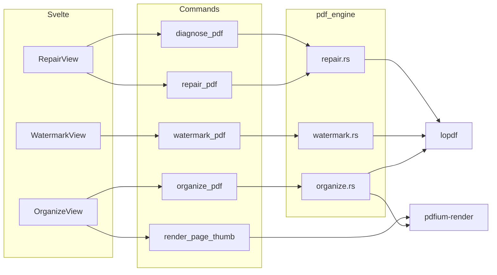

# MonkeyPDF — Fase 6: Reparar, Marca de agua, Ordenar páginas

## Alcance
- **Reparar** — diagnóstico + re-guardado limpio + reparación best-effort (xref, streams, objetos huérfanos, cifrado si se conoce la clave). Sin qpdf/mutool externo.
- **Marca de agua** — texto o imagen · posición 3x3 · mosaico · transparencia · rotación · rango de páginas · capa (encima/debajo).
- **Ordenar** — multi-archivo · grid de páginas arrastrable · rotar/borrar por página · insertar páginas entre otras · reset · CTA «Ordenar».
- Diseño Hallmark: Syne, banana stamp, hard shadows, SVG icons, `mp-*` patterns. Sin dependencias Cargo nuevas.

## Reutilizar
- `preview_pdf` en [preview.rs](src-tauri/src/pdf_engine/preview.rs) → JPEG data URL + textSpans.
- `PdfPageView` en [PdfPageView.svelte](src/lib/components/PdfPageView.svelte) — preview multi-página con zoom/pan.
- `getPdfPageCount` + `getPageMediabox` + `normRectToPdf` en [api.ts](src/lib/api.ts).
- Patrón overlay de [page_numbers.rs](src-tauri/src/pdf_engine/page_numbers.rs) (append `/Contents`).
- Patrón drag-overlay de [SignView.svelte](src/lib/tools/SignView.svelte) (coords 0–1 → puntos PDF).
- `FileDropZone`, `OutputPicker`, `ResultBanner`, `mp-chip`, `mp-field`, `mp-btn-primary`.
- `merge_pdfs` en [merge.rs](src-tauri/src/pdf_engine/merge.rs) — para construir el PDF ordenado a partir de (path, página) por página.

## Arquitectura



## Backend Rust — `src-tauri/src/pdf_engine/`

### `repair.rs`
- `Diagnosis { encrypted, pdf_version, page_count, has_xref_stream, has_eof, broken_objects, orphan_objects, missing_pages, linearized, warnings: Vec<String> }`
- `diagnose_pdf(path) -> Diagnosis` — carga con `lopdf::Document::load`, recorre `objects`, verifica trailer/Root/Pages/EOF, detecta streams rotos (Length mismatch), objetos sin referencia, páginas sin MediaBox.
- `repair_pdf(path, output, password: Option<String>) -> OpResult`:
  1. Carga (con password si está cifrado).
  2. Si cifrado y hay password → `decrypt` con lopdf; si no hay password, falla con mensaje claro.
  3. Recorre objetos: elimina huérfanos (no referenciados desde Root/Pages), repara streams con `Length` inconsistente (re-calcular), elimina duplicados, normaliza `xref` (rebuild via `doc.renumber_objects()` + `doc.compress()`).
  4. Re-guarda limpio (sin cifrado, sin linearización).
- Best-effort: si un stream no se puede leer, se descarta con warning, no se aborta.

### `watermark.rs`
- `WatermarkSpec { mode: text|image, text?, font?, size?, bold, italic, underline, color, image_path?, position: 3x3 grid index 0-8, mosaic: bool, transparency: 0-100, rotation: 0|45|90|180, page_from, page_to, layer: above|below }`
- `watermark_pdf(path, output, spec) -> OpResult`:
  - **Texto:** crea Form XObject con `BT /Fw size Tf ... Tj ET` (font Type1 Helvetica o bundled font).
  - **Imagen:** load PNG/JPG → image XObject (igual que [sign.rs](src-tauri/src/pdf_engine/sign.rs) con SMask alpha).
  - **Posición 3x3:** mapea índice 0-8 a (x,y) según MediaBox de cada página (esquinas/centros).
  - **Mosaico:** repite el XObject en grid calculado por tamaño del XObject + padding.
  - **Transparencia:** `gs` graphics state con `ca` alpha (extGState) o `alpha=transparency/100` en imagen.
  - **Rotación:** matriz `cm` con cos/sin.
  - **Rango de páginas:** aplica solo a `page_from..=page_to`.
  - **Capa:** `above` → append al final de `/Contents`; `below` → prepend al inicio.
  - Patrón overlay de page_numbers.rs.

### `organize.rs`
- `PageRef { source_path: String, page: u32 }` — una página de un PDF origen.
- `organize_pdf(pages: Vec<PageRef>, output: String) -> OpResult`:
  - Por cada `PageRef`: carga el doc origen con lopdf, copia la página (dict + streams + resources) al doc destino, reasigna `Parent`.
  - Reutiliza lógica de `merge.rs` (copia profunda de páginas entre docs).
  - Valida que `page` exista en el origen.
- `render_page_thumb(path, page, max_width) -> FilePreview` — wrapper fino sobre `preview_pdf` (ya existe, reusar directo desde el frontend).

### Registro
[commands.rs](src-tauri/src/commands.rs) + [lib.rs](src-tauri/src/lib.rs): `diagnose_pdf`, `repair_pdf`, `watermark_pdf`, `organize_pdf` (async + `spawn_blocking`).

## Frontend Svelte

### Rail / API / icons
- Nuevos `ToolId`: `repair`, `watermark`, `organize` en [api.ts](src/lib/api.ts).
- Grupos:
  - `organize` → **core** (junto a Merge/Split) — posición tras `split`.
  - `repair` → **suite** (junto a Protect) — posición tras `protect`.
  - `watermark` → **advanced** (junto a Censura/Crop) — posición tras `crop`.
- Rail pasa a **01–19**. Actualizar [design.md](design.md) y empty state de [App.svelte](src/App.svelte) a "01–19 tools".
- Iconos en [Icon.svelte](src/lib/components/Icon.svelte):
  - `repair` — llave inglesa o tuerca (`M9 11l2 2 4-4-2-2a4 4 0 0 0-4 4z` + path).
  - `watermark` — gota sobre página (`M12 3l4 6a4 4 0 1 1-8 0z` + rect).
  - `organize` — cuadrícula con flecha (`M4 4h6v6H4zM14 4h6v6h-6zM4 14h6v6H4zM14 14h6v6h-6z` + swap).

### `RepairView.svelte` — `src/lib/tools/RepairView.svelte`
- FileDropZone PDF · OutputPicker · ResultBanner.
- Al cargar el PDF → `diagnose_pdf` → tarjeta de diagnóstico (lista de `mp-chip` con estado: OK / warning / error).
- Checkbox «Quitar cifrado» (solo si está cifrado) + input password si aplica.
- CTA «Reparar» → `repair_pdf(path, output, password|null)`.
- Estilo: tarjeta de diagnóstico con stamps de color (banana=warning, ink=error, paper=ok).

### `WatermarkView.svelte` — `src/lib/tools/WatermarkView.svelte`
- FileDropZone PDF · OutputPicker · ResultBanner.
- Sidebar derecho (estilo SignView) con secciones:
  - **Modo:** dos botones grandes `Agregar texto` / `Agregar imagen` (chips `mp-chip` grandes con icono).
  - **Texto:** input `Texto:` + toolbar fuente (Syne + 2 system fonts) + tamaño + B/I/U + color (4 swatches como SignatureModal).
  - **Imagen:** botón «Añadir imagen» → FileDropZone png/jpg.
  - **Posición:** grid 3x3 de 9 botones (uno seleccionado).
  - **Mosaico:** checkbox.
  - **Ajustes:** `Transparencia` (select 0/25/50/75/100), `Rotación` (select 0/45/90/180).
  - **Páginas:** dos inputs `de la página [1] a [N]`.
  - **Capa:** dos botones `Por encima` / `Por debajo`.
- Preview central: render de la página 1 con overlay del watermark (calculado en JS, sin horneado) para feedback visual inmediato.
- CTA «Insertar marca de agua» → `watermark_pdf(path, output, spec)`.

### `OrganizeView.svelte` — `src/lib/tools/OrganizeView.svelte`
- FileDropZone multi-PDF · OutputPicker · ResultBanner.
- Sidebar derecho:
  - Header «Ordenar PDF» + «Archivos:» lista de archivos cargados (cards con nombre + handle de drag para reordenar archivos enteros).
  - Botón «Restablecer» (vuelve al orden original).
  - CTA «Ordenar» → `organize_pdf(pages, output)`.
- Workspace central: grid de thumbnails (1 por página, mezcla de todos los archivos en orden actual). Cada thumb:
  - Render vía `previewPdf(path, page, 240)`.
  - Badge `p{page}` + nombre corto del archivo.
  - Botones flotantes: rotar 90° (solo visual, aplica al ordenar) y eliminar.
  - Drag & drop para reordenar (pointer events, no HTML5 DnD — más fluido).
  - Entre thumbs: botón «+» para insertar páginas de otro PDF en esa posición (mini modal FileDropZone).
- Estado: `pages: PageRef[]` con orden actual. Rotar/eliminar muta el array. Insertar abre un picker rápido.
- Al ordenar: mapea `pages` a `PageRef[]` → `organize_pdf`.

### Modelo de datos (frontend)
```ts
interface PageRef { sourcePath: string; page: number; rotate?: 0|90|180|270; deleted?: boolean }
interface WatermarkSpec {
  mode: 'text' | 'image'
  text?: string; font?: string; size?: number; bold?: boolean; italic?: boolean; underline?: boolean; color?: string
  imagePath?: string
  position: number // 0-8
  mosaic: boolean
  transparency: number // 0-100
  rotation: number // 0|45|90|180
  pageFrom: number; pageTo: number
  layer: 'above' | 'below'
}
```

## Verificación
- `cargo test`: nuevo `tests/fase6_tools.rs` — `diagnose_pdf` sobre PDF sano + PDF con xref roto (sintético); `repair_pdf` roundtrip; `watermark_pdf` con texto + con imagen + mosaico; `organize_pdf` con 2 PDFs de 2 páginas cada uno (4 páginas out).
- `npm run build` + `npm run tauri:dev` manual: diagnosticar PDF sano, aplicar marca de agua texto y imagen, reordenar páginas arrastrando, rotar/borrar, insertar, ordenar y abrir resultado.
- README: añadir Fase 6 con las 3 herramientas.

## Orden
1. `repair.rs` + commands + `RepairView`
2. `watermark.rs` + commands + `WatermarkView`
3. `organize.rs` + commands + `OrganizeView`
4. Rail/Icon/App/design.md/README + tests + build
