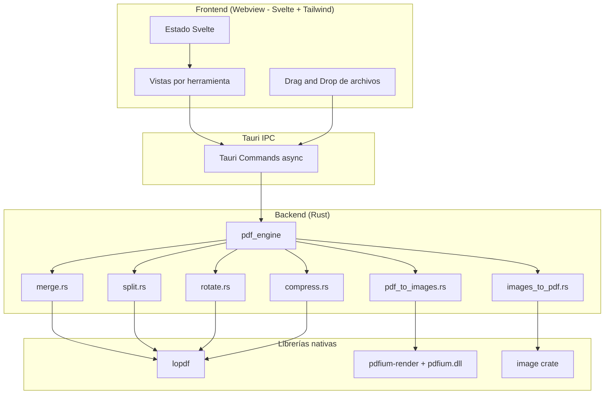

# MonkeyPDF - Fase 1: Núcleo Esencial

## Arquitectura



## Estado actual del entorno

- Workspace `c:\Users\deman\OneDrive\Documents\MonkeyPDF` vacío
- Node.js v24.12.0 y npm 11.6.2 instalados
- **Rust NO instalado**: se instalará via `winget install Rustlang.Rustup` (requiere MSVC Build Tools; el instalador de rustup lo gestiona o se instala `Microsoft.VisualStudio.2022.BuildTools` con carga de trabajo C++)
- Objetivo inicial: Windows x64 (arquitectura preparada para cross-platform después)

## Estructura del proyecto

```
MonkeyPDF/
├── package.json
├── vite.config.ts
├── svelte.config.js
├── tailwind / postcss config
├── index.html
├── src/                          # Frontend Svelte
│   ├── app.css
│   ├── App.svelte
│   ├── lib/
│   │   ├── components/
│   │   │   ├── FileDropZone.svelte
│   │   │   ├── ToolCard.svelte
│   │   │   └── OutputPicker.svelte
│   │   ├── tools/
│   │   │   ├── MergeView.svelte
│   │   │   ├── SplitView.svelte
│   │   │   ├── RotateView.svelte
│   │   │   ├── CompressView.svelte
│   │   │   ├── PdfToJpgView.svelte
│   │   │   └── JpgToPdfView.svelte
│   │   └── api.ts                # wrappers de invoke()
│   └── main.ts
└── src-tauri/
    ├── Cargo.toml
    ├── tauri.conf.json
    ├── build.rs
    ├── resources/pdfium.dll      # binario PDFium (descargado)
    └── src/
        ├── lib.rs                # registro de comandos
        ├── error.rs              # AppError (thiserror) -> serializable a frontend
        ├── commands.rs           # #[tauri::command] wrappers async
        └── pdf_engine/
            ├── mod.rs
            ├── merge.rs
            ├── split.rs
            ├── rotate.rs
            ├── compress.rs
            ├── pdf_to_images.rs
            └── images_to_pdf.rs
```

## Pasos de implementación

### 1. Toolchain y scaffold
- Instalar Rust: `winget install Rustlang.Rustup` (+ MSVC C++ Build Tools si falta linker)
- Scaffold manual (más control que `create-tauri-app`): `npm create vite@latest . -- --template svelte`, luego `npm install -D @tauri-apps/cli@latest` y `npm run tauri init`
- Configurar `tauri.conf.json`: identificador `com.monkeypdf.app`, ventana 1100x750, bundle resources con `resources/pdfium.dll`
- TailwindCSS v4 + plugin Vite (`@tailwindcss/vite`)

### 2. Dependencias Rust (`src-tauri/Cargo.toml`)
- `tauri = "2"` (features: ninguna extra por ahora)
- `tauri-plugin-dialog` (selector de carpeta de salida) y `tauri-plugin-fs`
- `lopdf = "0.36"` — unir, dividir, rotar, comprimir
- `pdfium-render = "0.8"` — render PDF → JPG (bind dinámico a `pdfium.dll`)
- `image = "0.25"` — JPG → PDF y recompresión interna
- `thiserror`, `serde`, `serde_json`
- `tokio` no es necesario: los comandos pesados se envuelven en `tauri::async_runtime::spawn_blocking`

### 3. PDFium en Windows
- Descargar `pdfium-win-x64.tgz` desde [bblanchon/pdfium-binaries](https://github.com/bblanchon/pdfium-binaries/releases), extraer `pdfium.dll` a `src-tauri/resources/`
- En runtime: `Pdfium::bind_to_library(Pdfium::pdfium_platform_library_name_at_path("./"))` con fallback a ruta de recursos de Tauri (`path_resolver().resource_dir()`)
- Helper `pdf_engine/mod.rs` con `fn pdfium() -> &'static Pdfium` usando `std::sync::OnceLock`

### 4. Motor PDF (Rust) — 6 comandos Tauri
Todos devuelven `Result<OpResult, AppError>` donde `OpResult { output_paths: Vec<String>, page_count: u32, elapsed_ms: u64 }`:

| Comando | Firma (args clave) | Implementación |
|---|---|---|
| `merge_pdfs` | `paths: Vec<String>, output: String` | `lopdf`: merge de `Document` por orden, renumeración de objetos |
| `split_pdf` | `path, ranges: Vec<(u32,u32)>, output_dir` | `lopdf`: extraer páginas por rango a nuevos documentos |
| `rotate_pdf` | `path, angle: u32 (90/180/270), pages: Option<Vec<u32>>, output` | `lopdf`: set `/Rotate` en diccionario de página |
| `compress_pdf` | `path, quality: u8, output` | `lopdf`: `compress()` + recompresión de imágenes DCT con `image` a calidad dada |
| `pdf_to_jpg` | `path, dpi: u32, output_dir` | `pdfium-render`: render por página a bitmap → JPEG |
| `jpg_to_pdf` | `paths: Vec<String>, output` | `image` decode + `lopdf` crear página A4 por imagen (fit proporcional) |

- `error.rs`: enum `AppError` (`Io`, `Pdf`, `Pdfium`, `Image`, `InvalidInput`) serializado con `serde` para que el frontend reciba mensajes legibles
- Cada comando valida existencia de archivos, extensión y permisos de escritura antes de procesar

### 5. Frontend Svelte
- `api.ts`: wrappers tipados de `invoke()` para los 6 comandos
- `App.svelte`: grid de herramientas (home) → navegación a vista de herramienta (estado simple con stores, sin router)
- `FileDropZone.svelte`: usa `getCurrentWebview().onDragDropEvent` de `@tauri-apps/api` (evento nativo que expone **rutas reales**, no File objects) + fallback a input file
- Vistas: lista de archivos ordenables (merge/JPG→PDF con botones subir/bajar), campos de rangos (split), selector de ángulo (rotate), slider de calidad (compress), selector de DPI (PDF→JPG)
- `OutputPicker.svelte`: diálogo nativo vía `@tauri-apps/plugin-dialog` para carpeta/archivo de salida
- Feedback: spinner durante procesamiento + toast con resultado (rutas de salida, tiempo)
- Estilo: Tailwind, tema oscuro, diseño limpio tipo suite de herramientas

### 6. Verificación
- `npm run tauri dev`: probar las 6 herramientas con PDFs reales (merge de 3 PDFs, split por rangos, rotación, compresión con reducción de tamaño medible, conversión bidireccional PDF↔JPG)
- `cargo test` en `src-tauri` para funciones puras del engine (sin IPC)
- `npm run tauri build` para verificar que el instalador empaqueta `pdfium.dll`

## Preparado para fases futuras
- `pdf_engine/` como módulo raíz extensible: `office.rs` (LibreOffice headless, Fase 2), `ocr.rs` (Tesseract, Fase 3), `ai.rs` (reqwest + OpenAI/Claude, Fase 4)
- Sección de Settings en UI reservada para API keys (Fase 4, `tauri-plugin-store`)
